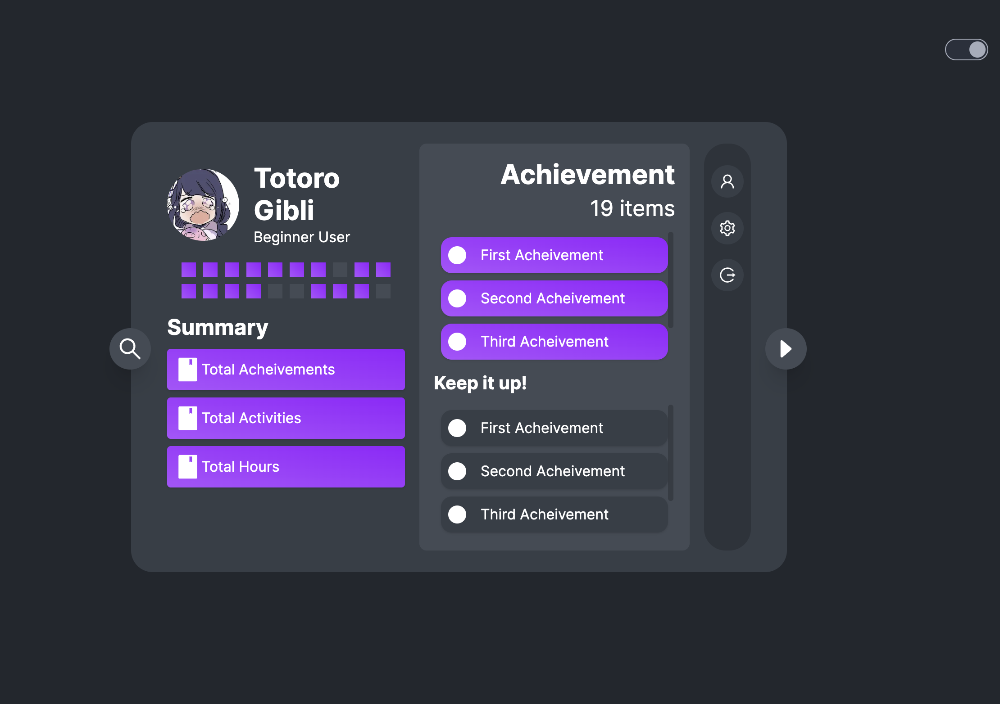

# Tendon (Again?)

LMS Extension/Addon/StandAlone? on MyCourseVille (MCV)

## Remark (Credit Claiming)

Cloning from previous semester frontend's repo : [Frontend Only](https://github.com/JinDamanee2544/tendon-again)

## Features

- [x] Component Interaction Animation
- [x] Light/Dark Theme
- [x] Mindmap-liked Course Display
- [x] Displaying Learning's material
- [x] Progress tracking
- [x] Authentication

## Frontend Stack

- Next.js
- TailwindCSS
- Framer Motion

## UI Design

I have designed its UI in previous year with Figma : [Figma](https://www.figma.com/file/vK6ayZG951BVAj2nzYaXqo/TENDON-PROJECT?node-id=0%3A1)

## Backend Part

- Not my part, But you can see it in this repo : [Tendon's Backend](https://github.com/TendonT52/tendonAgain)
- API's Doc : [Swagger](http://24.199.72.217/#/) but it's not updated now
